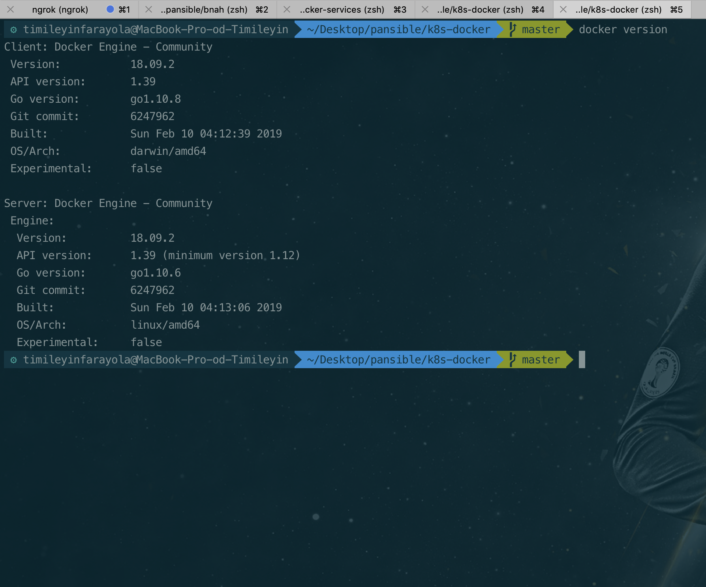

# Containerization with Docker & Creating Services with Docker Compose
Packaging a Node.JS application with back-end, frontend and database services inside containers and using docker-compose to start up the services.

#### Tools
1. [`Docker`](https://www.docker.com) Docker is a tool designed to make it easier to create, deploy, and run applications by using containers. Containers allow a developer to package up an application with all of the parts it needs, such as libraries and other dependencies, and ship it all out as one package.

2. Docker Compose - Compose is a tool for defining and running multi-container Docker applications. With Compose, you use a YAML file to configure your application's services. Then, with a single command, you create and start all the services from your configuration.

## Creating Services with Docker
 - First thing first, We need to make sure we have Docker Engine installed on our computer. To check if Docker is installed, run this command `docker version` on the Terminal. If docker is on the computer, we should see an output like this 
 If the `docker version` command gives error, that means docker isn't installed. Visit [https://docs.docker.com/install/](https://docs.docker.com/install/) to get instructions on how to install docker for your specific OS platform.
 For MacOS users, you can install Docker via Homebrew. Follow this [Homebrew Installation Tutorial](https://treehouse.github.io/installation-guides/mac/homebrew) to install Homebrew on your Mac. With Homebrew installed on your Mac, Run `brew cask install docker` on your terminal to install Docker.

 - With Docker installed on your machine, clone this repository by typing this command on your CLI [`git clone https://github.com/rafmme/docker-services`](https://github.com/rafmme/docker-services)

 - After cloning the repository above containing the dockerfiles for creating the docker images and the docker-compose file for starting up multiple containers from the docker images, `cd` into the Docker directory where the dockerfiles are using `cd docker-services/Docker`

 - Ensure that your current directory on the terminal is the `Docker/` directory. While in the `Docker/` directory, you need to clone the Node.JS frontend and backend project repository from Github by typing this commands on your terminal.
 ```
    git clone https://github.com/andela/neon-ah-backend backend
    git clone https://github.com/andela/neon-ah-frontend frontend
 ```

 - After cloning the repos, ensure there are folders named `backend` & `frontend` inside the `Docker/` directory. Inside the folders are the source code for the backend project & frontend respectively.

 - With the project repos cloned, `cd` back to the project's `docker-services` root directory and run the commands below to build the docker images for the frontend and backend and also to create containers from the images.
 ```
    docker-compose build
    docker-compose up
 ```
