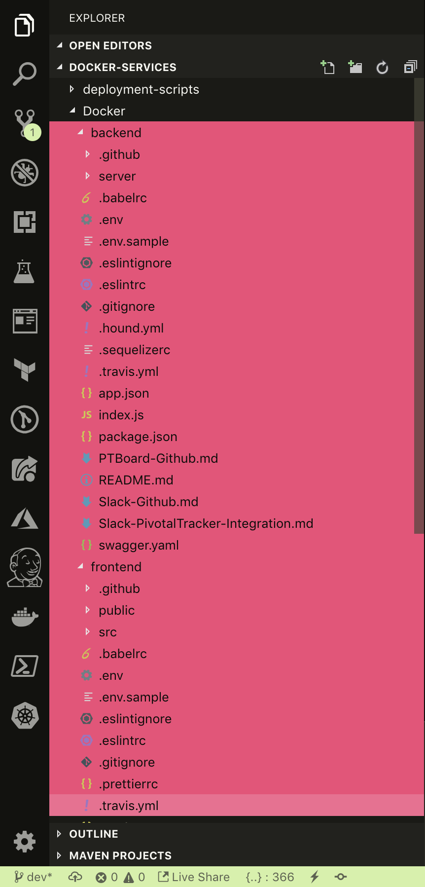
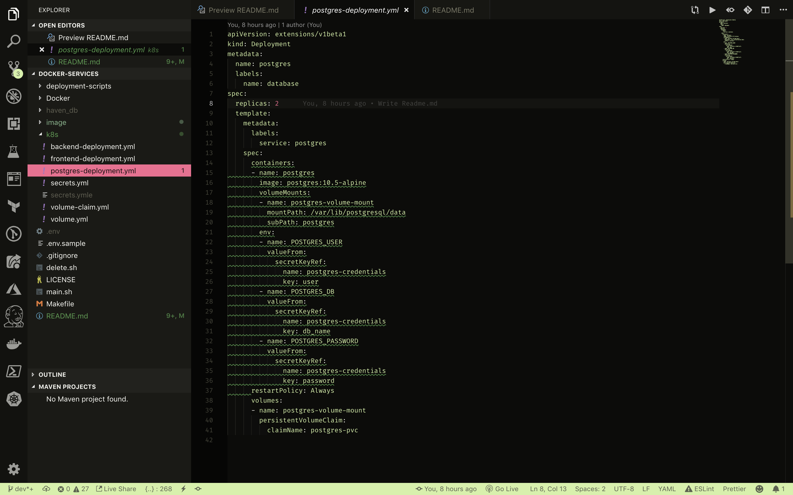
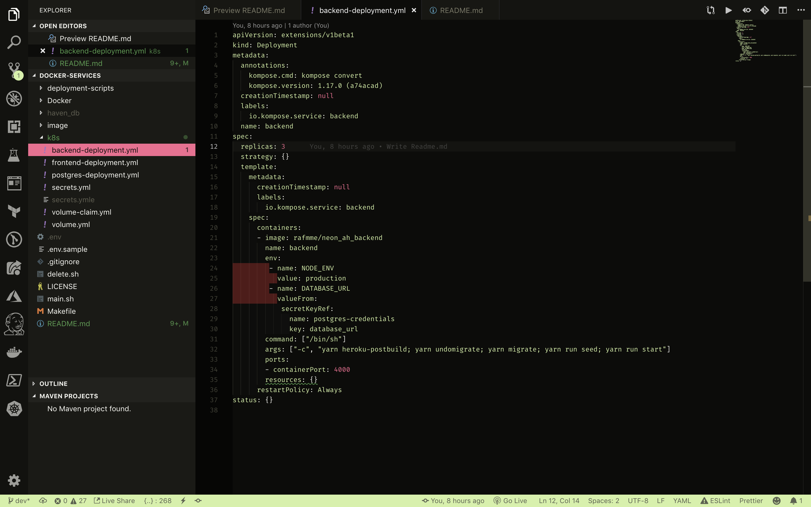
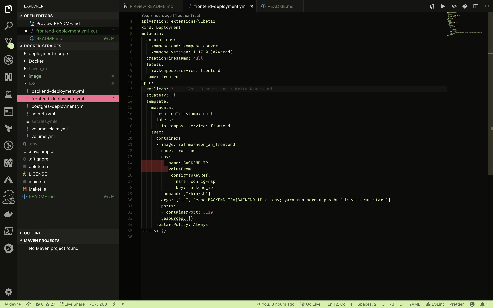

# Using Containers for Deployment & Kubernetes (k8s) for Containers orchestration
Containerizing a Node.JS application with back-end, frontend and database services inside Docker containers and using Kubernetes for the containers orchestration i.e handles the automation of deployment, scaling of application, and operations of application containers across clusters.

#### Tools
1. [`Docker`](https://www.docker.com) Docker is a tool designed to make it easier to create, deploy, and run applications by using containers. Containers allow a developer to package up an application with all of the parts it needs, such as libraries and other dependencies, and ship it all out as one package.

2. [`Kubernetes (k8s)`](https://kubernetes.io) - k8s is an open source container management tool hosted by Cloud Native Computing Foundation (CNCF)

### How containers work with the application
   - In order to containerize the application, first thing to be do is to build the docker images for the frontend and backend of the application. With the built Docker images, I can then spin up containers running the images.
     -  For this project, I deployed the `aws-deploy` branch on the project's git repository. To get started with the building of the docker images, I ran the `cd Docker` command on the terminal to change directory to the `Docker` folder because that's where the project's code from GitHub will be cloned to and also it contains the docker files for building the frontend & backend docker images.
     While in the `Docker` folder, the commands below were used to clone the frontend and backend repositories
        ```
         git clone -b aws-deploy https://github.com/rafmme/neon-ah-backend backend
         git clone -b aws-deploy https://github.com/rafmme/neon-ah-frontend frontend
        ```
     

      - In the `Docker` folder, there are two Dockerfiles, one for building the docker image for the frontend and the other for the backend. A Dockerfile is a text file with series of commands used to specify directives on how to build docker images. Below is the snapshot for the `frontend.dockerfile` for the frontend part of the project.
      
         - As seen in the `frontend.dockerfile` snapshot, I started by importing the base image I'll be building the frontend docker image on. Using the `FROM` directive, I imported the Node.JS `node:10.15.3-alpine`  from the Docker hub image which will serve as the base image for the project since the project was built using Node.JS.
         - Next directive in the `frontend.dockerfile` is the `LABEL` which was used to specify the maintainer for the image. The `LABEL maintainer` line isn't required to make a working Docker image but it's good practice to include it.
         - `WORKDIR` - The `WORKDIR` directive is used to set the working directory for any subsequent `RUN, COPY, CMD, ENTRYPOINT, or ADD` directive. For the frontend image, `/src/app/frontend` was set as the working directory.
         - `COPY` - The `COPY` directive is used to copy files from the build context into the image. COPY line in the dockerfile was used to copy the frontend sorce code in the `frontend` folder that was cloned from GitHub into the working directory `/src/app/frontend`.
         - `RUN` - The RUN directive runs the given instruction inside the container. I made use of the RUN directive to run `yarn install` to install the NPM dependencies for the project and `yarn run heroku-postbuild` for bundling the project with Webpack for production.
         - `EXPOSE` - The EXPOSE directive indicates to Docker that the container will have a process listening on the specified PORT. I used the EXPOSE directive to open up the port `3110` on the container where the frontend project server is running on.
         - `ENTRYPOINT` - Entrypoint allows us set an executable to be run where the container starts. In the `frontend.dockerfile`, the ENTRYPOINT directive was used to run the project's `yarn start` command which starts up the frontend server on port 3110.

      - Below is the snapshot for the `backend.dockerfile` for the backend part of the project.
      
         - As shown in the `backend.dockerfile` snapshot, I started by importing the base image I'll be building the backend docker image on. Using the `FROM` directive, I imported the Node.JS `node:10.15.3-alpine`  from the Docker hub image which will serve as the base image for the project since the project was built using Node.JS.
         - Next directive in the `backend.dockerfile` is the `LABEL` which was used to specify the maintainer for the image. The `LABEL maintainer` line isn't required to make a working Docker image but it's good practice to include it.
         - `ENV` - The ENV directive was used to set environment variables inside the image. In the `backend.dockerfile`, ENV was used to set an environment variable `NODE_ENV=production`.
         - `WORKDIR` - The `WORKDIR` directive is used to set the working directory for any subsequent `RUN, COPY, CMD, ENTRYPOINT, or ADD` directive. For the backend image, `/src/app/backend` was set as the working directory.
         - `COPY` - The `COPY` directive is used to copy files from the build context into the image. COPY line in the dockerfile was used to copy the backend sorce code in the `backend` folder that was cloned from GitHub into the working directory `/src/app/backend`.
         - `RUN` - The RUN directive runs the given instruction inside the container. I made use of the RUN directive to run `yarn install` to install the NPM dependencies for the project and `yarn run heroku-postbuild` for transipiling the project written with JS ES6 to ES5 for production.
         - `EXPOSE` - The EXPOSE directive indicates to Docker that the container will have a process listening on the specified PORT. I used the EXPOSE directive to open up the port `4000` on the container where the backend project server is running on.
         - `ENTRYPOINT` - Entrypoint allows us set an executable to be run where the container starts. In the `backend.dockerfile`, the ENTRYPOINT directive was used to run the project's `yarn start` command which starts up the backend server on port 4000.

      - With the Dockerfiles created, the frontend & backend docker images can be built from their respective docker files by running the commands below inside the `Docker` directory.
         - The docker command below was used to build the docker image for the frontend using the `frontend.dockerfile` as stated with the `-f` file flag in the command which takes the path of the Dockerfile. The `-t` tag flag was used to tag/give name to the docker image being built
         ```
            docker build -t rafmme/neon_ah_frontend -f ./frontend.dockerfile  .
         ```
         - The docker command below was used to build the docker image for the backend using the `backend.dockerfile` as stated with the `-f` file flag in the command which takes the path of the Dockerfile. The `-t` tag flag was used to tag/give name to the docker image being built
         ```
            docker build -t rafmme/neon_ah_backend -f ./backend.dockerfile  .
         ```
      - After the successful completion of the images build, the images were pushed to the Docker hub repository with the commands below
         ```
            export DOCKER_ID_USER="rafmme"
            docker login
            docker push $DOCKER_ID_USER/neon_ah_frontend:latest
            docker push $DOCKER_ID_USER/neon_ah_backend:latest
         ```
         

-------------------------------------------------------------------------------------------------------------------------

- With the frontend & backend docker images built & pushed to the Docker hub repository, the next step was to create a k8s cluster on GCP's Google Kubernetes Engine (GKE) that will handle the deployment, scaling and maintaining the containerized application. Bash Scripts was used to automate the whole process.
   ```
            export PROJECT_NAME="neon-ah-1555609505"
            export CLUSTER_NAME="neon-ah-cluster"
            export COMPUTE_ZONE="europe-west2"
            export REGION="europe-west2-a"
            export MACHINE_TYPE="g1-small"
            export NUM_OF_NODES=1
            export DISK_CAPACITY=2GB
   ```
   -  The above environment variables where exported via the terminal so that the bash scripts can access the variables for configuring the GCP project's name, the cluster name, compute zone, region, machine type, number of nodes in the cluster, disk capacity and the billing account associated with the project.
   -------------------------------------------------------------------------------------------------------------------  
   
   
   -  The `setup_gke` script contains functions that handles running commands that configures the GCP project, creates the GKE cluster and GCP Disk storage for persisting the application's data.
   --------------------------------------------------------------------------------------------------------------------

   
   
   -  The `db_deploy` script handles the deployment of the container running the db for the application and exposing it to external client on the k8s cluster using the `kubectl` cli tool with the state described in the `postgres-deployment.yml`  file.

   --------------------------------------------------------------------------------------------------------------------
   
   
   -  The `backend_deploy` script handles the deployment of the container running the backend docker image for the application and exposing it to external client using LoadBalancer on the k8s cluster using the `kubectl` cli tool with the state described in the `backend-deployment.yml`  file.

   --------------------------------------------------------------------------------------------------------------------

   
   
   -  The `frontend_deploy` script handles the deployment of the container running the frontend docker image for the application and exposing it to external client using LoadBalancer on the k8s cluster using the `kubectl` cli tool with the state described in the `frontend-deployment.yml`  file.

   --------------------------------------------------------------------------------------------------------------------

  ## How To start the Deployment process
To start the deployment process, while on the terminal `cd` to this project's directory and run the following commands on the CLI.
            
            make deploy
Also to clean up and delete resources created, run the following commands on the CLI.
            
            make destroy
