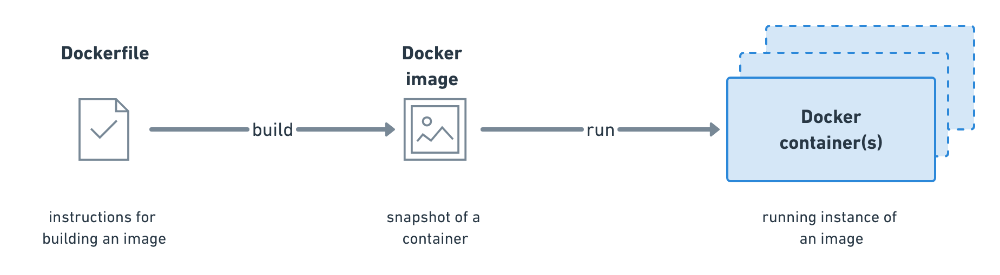

# Using Containers for Deployment on Tembea
A container is a standard unit of software that packages up code and all its dependencies so the application runs quickly and reliably from one computing environment to another. A Docker container image is a lightweight, standalone, executable package of software that includes everything needed to run an application: code, runtime, system tools, system libraries and settings.

Container images become containers at runtime and in the case of Docker containers - images become containers when they run on Docker Engine. Available for both Linux and Windows-based applications, containerized software will always run the same, regardless of the infrastructure. Containers isolate software from its environment and ensure that it works uniformly despite differences for instance between development, staging and production.
 - `Container image`
This image will inform how a container is instantiated, determining which software components will run and how. You can also create an image from a container, and share these specifications with someone else, so that an app runs the same way on a developer’s laptop as it would in production.

 - `Container`
This describes a virtual environment that bundles the application code with all the binaries and libraries that are required to run an application. Since the container includes all of its dependencies, you don’t have to install anything on the host operating system, keeping it separate and pristine.

- `Container orchestration`
This refers to coordinating behaviors for containers and between containers, such as scheduling, resource management, and load balancing. In complex or dynamic ecosystems, teams will use an orchestration engine to control, manage, and automate this activity. Kubernetes (k8s) is a good Container Orchestration tool and the team uses it via Google's Kubernetes Engine platform.

#### Tools & Platforms used
1. [`Docker`](https://www.docker.com) Docker is a tool designed to make it easier to create, deploy, and run applications by using containers. Containers allow a developer to package up an application with all of the parts it needs, such as libraries and other dependencies, and ship it all out as one package.
2. CircleCI
3. Google Cloud Platform
4. Google Kubernetes Engine

### How containers work with the application
   - In order to containerize the application, first thing to be do is to build the docker images for the frontend and backend of the application. With the built Docker images, We can then spin up containers running the images which has everything the apps need to run.
      - Below is the snapshot for the `Dockerfile` for the frontend part of the Tembea product.
      
         - As seen in the `Frontend's Dockerfile` snapshot, The team makes use of multi-stage builds feature in Docker to enable the creation of a smaller container image for the frontend with better caching and smaller security footprintimage on. For the first stage of the build, using the `FROM` directive, the team uses `node:8-alpine` as the base image for the first build since the project is written in Node.JS/JavaScript
         - Next directive is the `LABEL` which was used to specify the application name for the image. The `LABEL application` line isn't required to make a working Docker image but it's good practice to include it.
         - `ARG` - The ARG directive was used to set ENV values during the build of the Docker image
         - `ENV` - The ENV directive was used to set environment variables inside the image. In the `Dockerfile`, environment variables `NODE_ENV` & `TERM` was set.
         - `RUN` - The `RUN` directive runs the given instruction inside the container. First `RUN` directive on `line 8` in the Dockerfile was used to run the `mkdir -p /usr/app` command which will create a nested directory `/usr/app` for the project. The other `RUN` directives runs commands that handles installing yarn package manager globally, angular/cli and other needed tools for the project, removing package-lock.json file, installing project's npm dependencies and building up the project.
         - `WORKDIR` - The WORKDIR directive is used to set the working directory for any subsequent RUN, COPY, CMD, ENTRYPOINT, or ADD directive. For the Dockerfile, the directory created with the RUN command on line 8 `/usr/app` was set as the working directory for the Docker image.
         - `COPY` - The COPY directive is used to copy files from the build context into the image.
         - For the Second stage of the build in the Dockerfile, using the `FROM` directive, the team uses `nginx:1.15.8-alpine` as base image which is to serve the app using the Nginx web server.
         - The first `COPY` directive in the second stage of the build copies a configuration file for setting up nginx into the nginx config folder inside the image. The second `COPY` directive was used to copy the artifacts in `dist/` from the first build to the default nginx public folder.
         - The `RUN` directive in the second stage build was used to run a command to remove the default files in the nginx public folder.

         ----------

      - Below is the snapshot for the `Dockerfile` for the backend part of the Tembea product.
      
         - As seen in the `Backend's Dockerfile` snapshot, using the `FROM` directive, the team uses `node:10-alpine` image as the base image for the first build since the project is written in Node.JS/JavaScript
         - Next directive is the `LABEL` which was used to specify the application name for the image. The `LABEL application` line isn't required to make a working Docker image but it's good practice to include it.
         - `ENV` - The ENV directive was used to set environment variables inside the image. In the `Dockerfile`, environment variables `NODE_ENV` & `TERM` was set.
         - `RUN` - The `RUN` directive runs the given instruction inside the container. First `RUN` directive on `line 7` in the Dockerfile was used to run the `mkdir -p /usr/app` command which will create a nested directory `/usr/app` for the project. The other `RUN` directives runs commands that handles installing yarn package manager globally, removing package-lock.json file, installing project's npm dependencies using yarn and building up the project.
         - `WORKDIR` - The WORKDIR directive is used to set the working directory for any subsequent RUN, COPY, CMD, ENTRYPOINT, or ADD directive. For the Dockerfile, the directory created with the RUN command on line 7 `/usr/app` was set as the working directory for the Docker image.
         - `COPY` - The COPY directive was used to copy files from the build context into the image. The team used the `COPY` directive to copy files like package.json, yarn.lock, .babelrc, the project codes in the `src/` directory into the image working directory `/usr/app`.

         ---------

   - The team uses Circle CI for continuous integration and delivery, If the developers pushes new codes, Circle CI runs tests and builds the project, if the build is successful, Docker Images for the product is built and pushed to the `gcr` private repository.
   For automating the deployment and spinng up containers from the built docker images, the team has scripts that handles the deployment & orchestration of the containers on a Kubernetes (k8s) cluster.
